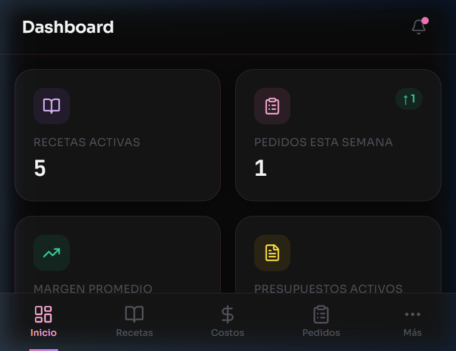
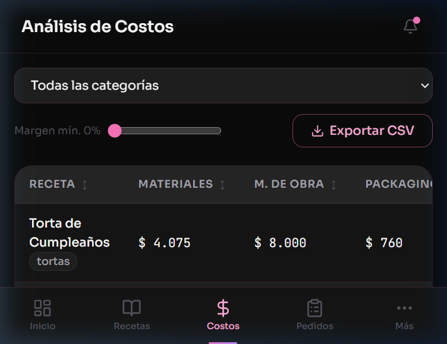
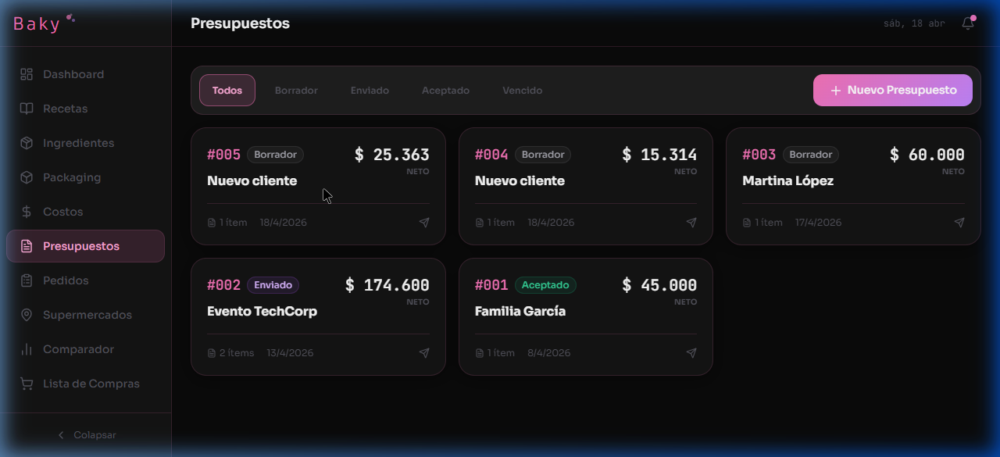
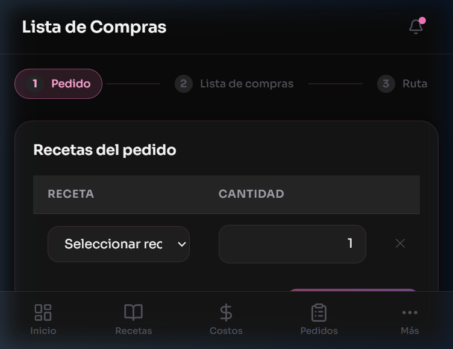
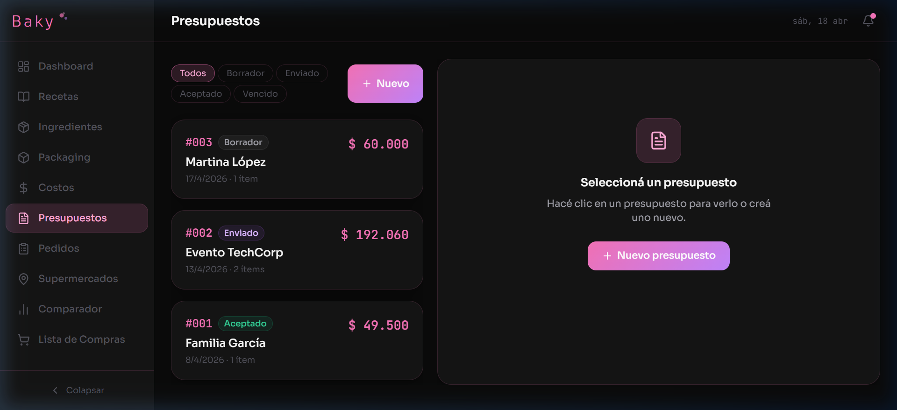
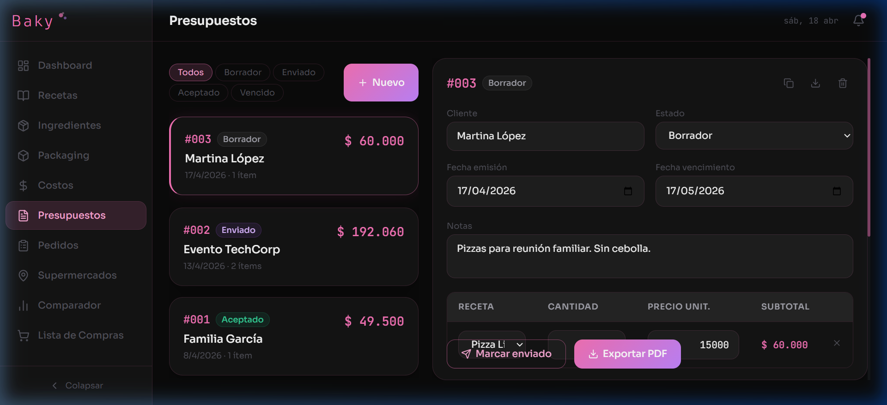
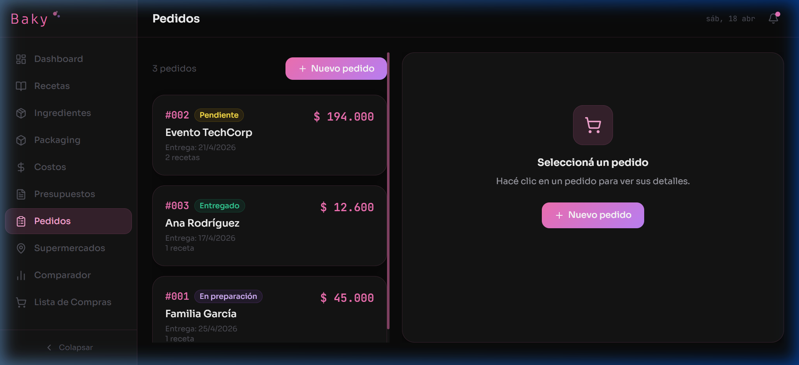
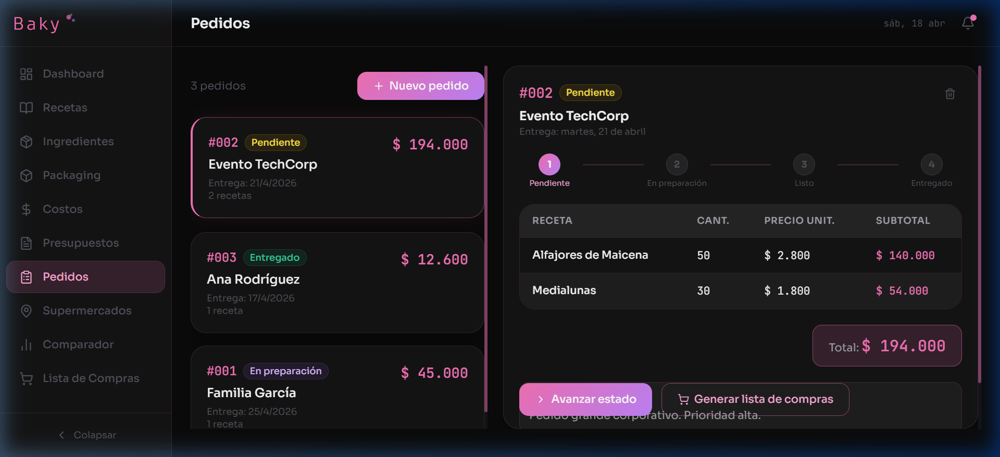

# Baky – Plataforma de Gestión para Pasteleros y Panaderos 🍞🧁

Baky es una solución integral diseñada exclusivamente para emprendedores y negocios de gastronomía, especializada en administrar recetas, costear ingredientes y proyectar la rentabilidad precisa libre de márgenes impositivos, logrando tener un control centralizado de todos los pedidos y finanzas.

¡Todo en una vista responsiva super intuitiva y visualmente premium!

## Capturas de Pantalla

### 📊 Dashboard
Visualizá tu actividad, resumen del día y rendimiento del negocio mediante estadísticas rápidas y paneles centralizados.


### 📈 Costeos e Ingeniería de Menú
No vuelvas a perder dinero estimando los costos "a ojo". Baky incluye cálculos transparentes y desglosados separando insumos de packaging y mano de obra.



### 🧾 Listas de Compras Inteligentes
Baky consolida inteligentemente todo lo que necesitas comprar para abastecer los pedidos en cola, separándolos para un recorrido práctico en el mercado.


### 📁 Gestión de Presupuestos Formales
Emití presupuestos para eventos corporativos o casamientos de manera profesional (incluyendo descuentos e impuestos personalizados que se aplican matemáticamente de manera sana, sin romper tu margen).



### 🛒 Tracker de Pedidos
Llevá pedidos desde que son "Pendientes", pasando por "En Preparación" hasta "Entregado", y no dejes baches de entregas nunca más.



## Funcionalidades Principales Destacadas

* 📱 **Mobile Resiliente:** Soporte integral para tablets y iPhones, convirtiendo densos paneles en interactivas "Drawers" full page y tablas deslizadas.
* 📝 **Componente Recetas (Modal lateral y Costos):** Puedes agrupar las recetas por ingredientes, sumar horas hombre (Mano de obra) y agregar empaquetado (Packaging). **La ganancia sugerida te garantizará el Mark-Up neto real**.
* 📉 **Local-first Persistente:** Los datos corren 100% en tu navegador a super velocidad (`localStorage`) usando Zustand.
* 💳 **Comparativa de Supermercados:** Analizá y loggeá los precios de la misma manteca y harina en sucursales o franquicias cercanas, visualizado espacialmente para elegir mejor proveedor.
* 🖨 **Exportaciones PDF:** Listo en un click para compartir por WhatsApp Web los detalles para tus clientes.

## Stack Tecnológico 💻
* Frontend: **React 19 + React Router 7**
* Herramienta de compilación principal: **Vite**
* Estilos: **Tailwind CSS + Vainilla para UI Tokens** 
* Manejo de Layouts: **Lucide React** (iconografía ágil)
* Manejo de estados: **Zustand**
* Validación de tipajes: **TypeScript + Zod v4**
* Calidad y Linter: **ESLint + React-Compiler (Reglas strictly configuradas)**

## Cómo Ejecutarlo

1. Clona el Repositorio.
2. Ejecuta la instalación usando **npm:**
```bash
npm install
```
3. Ejecuta el servidor Dev:
```bash
npm run dev
```

> **Baky** está optimizado y preparado para un despliegue directo sobre GitHub Pages o Vercel (`npm run build`).

---
Hecho con meticulosidad para profesionales de la gastronomía.
